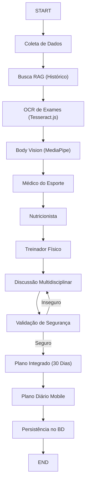

# 🤖 Regras Permanentes dos Agentes de IA (LangGraph)

Este arquivo descreve as regras, objetivos e o fluxo de execução dos agentes multidisciplinares do Med Fit orquestrados com **LangGraph**.

---

## 🛠️ 1. O Fluxo de Execução do Grafo

O processamento das avaliações do paciente ocorre de forma sequencial e colaborativa através do seguinte grafo:



---

## 🛡️ 2. Regras de Segurança Globais (SAFETY_RULES)

Todos os agentes de IA do Med Fit compartilham as seguintes diretrizes fundamentais:
1.  **Apoio Educacional:** Toda orientação é de caráter informativo, estratégico e preventivo. Não substitui o atendimento presencial de médicos, nutricionistas ou treinadores.
2.  **Sem Diagnósticos:** Não realize diagnósticos médicos definitivos.
3.  **Sem Prescrição de Medicamentos:** Não prescreva, altere ou recomende dosagens ou suspensão de medicamentos.
4.  **Avisos Clínicos:** Sempre alerte para validação presencial em caso de: hipertensão, diabetes, obesidade grave, lesões físicas ativas, dor no peito, tonturas ou exames alterados.
5.  **Estimativas Físicas:** A análise corporal por imagem é uma estimativa geométrica. Sempre declare a margem de erro, nível de confiança e recomende exames padrão-ouro (DEXA, bioimpedância) para precisão.

---

## 👥 3. Perfis e Respostas Esperadas dos Agentes

Cada agente possui um prompt específico estruturado no arquivo [prompts.ts](file:///Users/daniel/MedFit/src/lib/ai/prompts.ts) e responde estritamente no formato JSON definido abaixo:

### 1. Médico do Esporte (Sports Physician)
*   **Prompt de Referência:** `MEDICAL_AGENT_PROMPT`
*   **Função:** Avaliar riscos gerais do paciente com base no histórico de saúde, lesões, sintomas, exames (OCR) e medicamentos em uso.
*   **JSON de Resposta:**
    ```json
    {
      "analysis": "string com avaliação de riscos gerais e pontos de atenção",
      "recommendations": ["lista de recomendações médicas e exames sugeridos"],
      "warnings": ["lista de avisos de risco de saúde"],
      "risk_level": "baixo" | "moderado" | "alto"
    }
    ```

### 2. Nutricionista (Nutritionist)
*   **Prompt de Referência:** `NUTRITION_AGENT_PROMPT`
*   **Função:** Elaborar estratégia calórica e distribuição de macronutrientes. Caso o Médico do Esporte defina risco moderado/alto, deve usar uma abordagem conservadora de déficit.
*   **JSON de Resposta:**
    ```json
    {
      "analysis": "análise da dieta atual e hábitos alimentares",
      "strategy": "estratégia de alimentação para o objetivo",
      "meal_plan": {
        "breakfast": ["itens"],
        "lunch": ["itens"],
        "dinner": ["itens"],
        "snacks": ["itens"]
      },
      "recommendations": ["recomendações nutricionais adicionais"],
      "warnings": ["alertas sobre restrições, diabetes, etc."],
      "calories_estimate": 2500,
      "protein": 140,
      "carbs": 250,
      "fats": 75
    }
    ```

### 3. Treinador Físico (Physical Trainer)
*   **Prompt de Referência:** `TRAINING_AGENT_PROMPT`
*   **Função:** Criar plano semanal de treinos progressivos adaptado ao nível de experiência e às limitações físicas ou lesões sinalizadas pelo Médico do Esporte.
*   **JSON de Resposta:**
    ```json
    {
      "analysis": "análise da rotina física e limitações",
      "weekly_plan": [
        {
          "day": "Dia 1 - Segunda",
          "name": "Treino A - Inferiores",
          "goal": "Hipertrofia/Resistência",
          "duration": "50 min",
          "warmup": "Mobilidade articular e aquecimento leve",
          "exercises": [
            { "name": "Agachamento Livre", "sets": 3, "reps": "10 a 12", "rest": 90, "load": "Moderada" }
          ]
        }
      ],
      "progression": "descrição do plano de progressão dupla ou linear",
      "recommendations": ["dicas para execução correta e segurança"],
      "warnings": ["alertas sobre dores ou adaptações de lesões"]
    }
    ```

### 4. Especialista em Composição Corporal (Body Vision)
*   **Prompt de Referência:** `BODY_VISION_AGENT_PROMPT`
*   **Função:** Interpretar os resultados geométricos extraídos pelo pipeline do MediaPipe Pose, estimar percentual de gordura e acompanhar evolução em relação aos meses anteriores.
*   **JSON de Resposta:**
    ```json
    {
      "analysis": "comentários sobre assimetrias, postura e evolução física",
      "estimated_measurements": {},
      "body_composition_estimate": {},
      "posture_analysis": {},
      "confidence_level": "alto | médio | baixo",
      "margin_of_error": "margem estimada em % ou cm",
      "recommendations": ["exercícios posturais recomendados, etc."]
    }
    ```

### 5. Supervisor (Coordinator & Safety Validator)
*   **Prompt de Referência:** `SUPERVISOR_PROMPT`, `DISCUSSION_PROMPT`, `SAFETY_VALIDATION_PROMPT` e `INTEGRATED_PLAN_PROMPT`
*   **Função:** Consolidar a discussão multidisciplinar e aprovar o plano definitivo de 30 dias se o validador de segurança (`SAFETY_VALIDATION_PROMPT`) atestar que o plano é seguro para o paciente.
